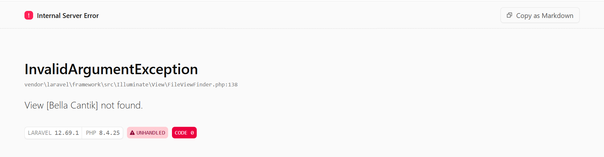

# Read 

1.Buka public/index.php. Baca dari atas ke bawah. Tulis dalam 3 kalimat apa yang dilakukan berkas ini.
`Jawab:Berkas public/index.php ini berfungsi sebagai pintu masuk tunggal yang menerima seluruh permintaan pengunjung web untuk diarahkan ke dalam sistem framework Laravel. Melalui kode di dalamnya, berkas ini secara otomatis memeriksa status pemeliharaan situs, memuat semua dependensi kode via Composer, dan mengaktifkan mesin utama Laravel.`

2.Buka bootstrap/app.php. Identifikasi bagian mana yang mengurus route, mana yang mengurus middleware, mana yang mengurus exception.
`Jawab:
- **`->withRouting(...)`**: Bagian ini ngatur di mana kita naruh daftar alamat URL web kita (contohnya nyambungin ke `routes/web.php`).
- **`->withMiddleware(...)`**: Bagian ini jadi satpam/penengah. Dia ngecek siapa yang boleh masuk dan mencegah akses yang dilarang sebelum beneran masuk ke dalam aplikasi.
- **`->withExceptions(...)`**: Bagian ini khusus nangani kalau web kita lagi *error* biar tampilannya nggak hancur lebur atau nampilin pesan aneh ke *user*.

3. Buka routes/web.php. Temukan route yang menghasilkan halaman selamat datang. Ubah teksnya, muat ulang browser, pastikan berubah.
```
Jawab: 

```

4. Jalankan php artisan route:list. Cocokkan keluarannya dengan isi routes/web.php.
```
output php artisan route:list: 
  GET|HEAD  / .......................................................................................................... routes/web.php:5
  GET|HEAD  storage/{path} ......... storage.local › vendor/laravel/framework/src/Illuminate/Filesystem/FilesystemServiceProvider.php:111
  PUT       storage/{path} .. storage.local.upload › vendor/laravel/framework/src/Illuminate/Filesystem/FilesystemServiceProvider.php:119
  GET|HEAD  up .............................. vendor/laravel/framework/src/Illuminate/Foundation/Configuration/ApplicationBuilder.php:224

routes/web.php:
    <?php

    use Illuminate\Support\Facades\Route;

    Route::get('/', function () {
    return view('welcome');
    });
```

#Break     
1	Ganti nama .env menjadi .env.bak	
	
2	Kosongkan nilai APP_KEY di .env		

3	Ubah DB_DATABASE menjadi nama yang tidak ada	

4	Ubah APP_DEBUG=false, lalu ulangi nomor 3
                                                  